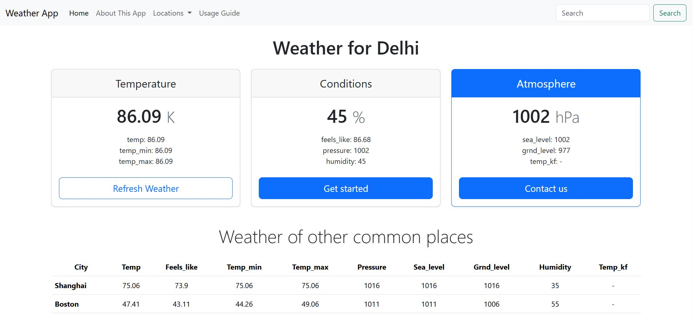
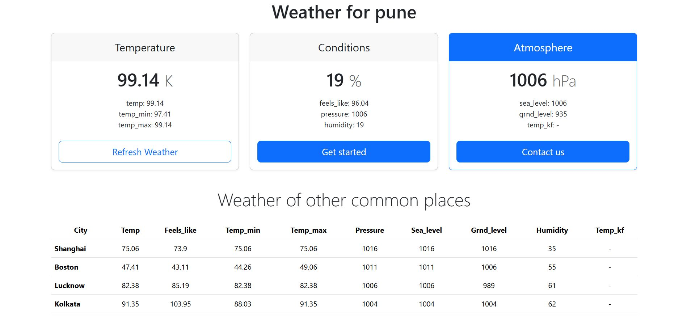

# Weather-app
A responsive weather web application that fetches real-time weather data using RapidAPI and displays temperature, humidity, pressure, and other atmospheric details for any city.

## 🚀 Features

* Search weather by city
* Displays temperature, humidity, pressure
* Shows multiple cities in a table
* Fast and easy to use

## 🛠 Tech Stack

HTML • JavaScript • RapidAPI

## ⚙️ Setup

1. Clone the repo
2. Add your API key in `script.js`
3. Open `index.html` in browser

## ⚠️ Note

API key is not included for security reasons.

## 📷 Screenshots

